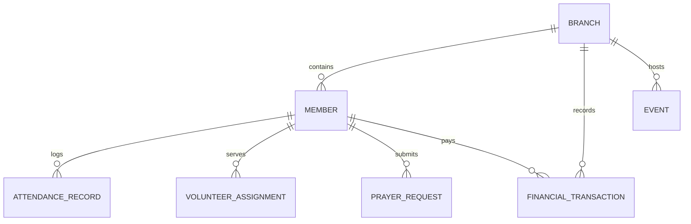

# Software Requirements Specification (SRS)
## Project: Church 2.0 Multi-Branch Church Management Platform

**Version:** 2.0 - **Last updated:** July 2026
**Change log (v2.0):** Revised after a competitive benchmark against Planning Center, Pushpay/CCB, Tithe.ly/Breeze, Subsplash, Rock RMS, FellowshipOne, ChurchTrac, Aplos, and Gloo (see `BENCHMARK.md`). Adds attendance/check-in, groups, recurring giving, pledge campaigns, tax statements, follow-up workflows, communications, and data-integrity requirements. New requirements are marked **[v2]**.

---

### 1. Introduction

#### 1.1 Purpose
This document provides a detailed specification of the software requirements for the **Church 2.0 Multi-Branch Church Management Platform**. The platform is designed as a unified digital ecosystem serving HQ (Headquarters) admins, individual branch administrators, department leaders, and congregation members.

#### 1.2 System Scope
Church 2.0 is built on a "One Church, Multiple Locations" paradigm. It delivers:
1. **HQ Super Admin Console**: Centralized oversight, branch creation, aggregated financial reports, and global member lookup.
2. **Branch Admin Console**: Daily branch management, localized financial reporting, roster management, and event calendar control.
3. **Ministry & Volunteer Hub**: Department organization, volunteer shifts scheduling, and prayer request tracking.
4. **Member Mobile App Interface**: Service streaming, digital bulletins, direct tithing/offering with automatic receipt generation, event RSVPs, and interactive pastoral assistance.
5. **AI-Driven Ministry Intelligence**: Weekly ministry snapshots, automated prayer request categorization, sermon repurposing, volunteer-to-role matching, and event optimization.

---

### 2. User Roles & Access Control (RBAC)

The system enforces hierarchical Role-Based Access Control:

| Role | Scope | Key Permissions |
| :--- | :--- | :--- |
| **Super Admin (HQ)** | Global | Create/delete branches, view cross-branch financial summaries, configure global integrations, system-wide member lookups. |
| **Branch Admin** | Local Branch | Manage local branch members, record local tithes/offerings, approve local events, schedule volunteers. |
| **Ministry Leader** | Local Dept | Manage volunteer rosters and rotas for their specific department (e.g., Usheing, Worship), log attendance. |
| **Member** | Personal | View media library, read Bible versions, RSVP to events, volunteer for tasks, perform digital giving, check personal contribution records. |

---

### 3. Data Schema & Architecture

To support the AI engines and operational integrity, data is organized under a single relational-style schema:

#### 3.1 Entities Definition

1. **Branch**
   - `id` (UUID): Unique branch identifier
   - `name` (String): Branch name (e.g., "Nairobi CBD", "Kawangware")
   - `location` (String): Address details
   - `created_at` (Timestamp)

2. **Member**
   - `id` (UUID): Unique member identifier
   - `branch_id` (UUID): Reference to Branch
   - `first_name` (String)
   - `last_name` (String)
   - `email` (String)
   - `phone` (String)
   - `family_id` (UUID): Groups members under a single family unit
   - `spiritual_milestones` (Array): E.g., `["Baptized: 2024-05-12", "Dedicated: 2020-03-01"]`
   - `volunteer_skills` (Array): E.g., `["Worship Vocals", "Video Editing", "First Aid"]`
   - `engagement_score` (Integer): AI-calculated engagement index (0-100)

3. **Financial Transaction**
   - `id` (UUID)
   - `branch_id` (UUID)
   - `member_id` (UUID, Nullable for anonymous giving)
   - `amount` (Decimal)
   - `category` (Enum): `["Tithe", "Offering", "Pledge", "Project Donation"]`
   - `date` (Timestamp)
   - `payment_method` (String): E.g., `["Mobile Money", "Credit Card", "Bank Transfer"]`
   - `receipt_url` (String)

4. **Event**
   - `id` (UUID)
   - `branch_id` (UUID)
   - `title` (String)
   - `description` (Text)
   - `start_time` (Timestamp)
   - `end_time` (Timestamp)
   - `volunteers_required` (Array of role profiles)
   - `rsvp_count` (Integer)

---

### 4. Functional Modules

#### 4.1 Centralized Membership & Family Database
- **HQ Aggregated Search**: Allows Super Admins to query members by name, status, or branch.
- **Family Mapping**: Links husband, wife, children, or relatives under a shared `family_id` for unified reporting.
- **Milestone Tracker**: Records dates and cert uploads for dedications, baptisms, marriages, and memberships.

#### 4.2 Financial Stewardship
- **Donation Logging**: Form for manual logging of cash/checks or digital triggers.
- **Receipt Generator**: Instantly builds a localized, numbered receipt for tax audits or personal records.
- **Analytics Dashboards**: Interactive charts mapping tithes vs. pledges, trends by branch, and monthly budget comparisons.
- **[v2] Recurring Giving**: Members schedule repeating gifts (weekly/monthly) to a fund; admins see active schedules. Table stakes across Tithe.ly, Pushpay, Planning Center.
- **[v2] Pledge Campaigns**: Named campaigns (e.g. Building Fund) with a goal, aggregated progress bar, and per-member pledge tracking against fulfilled giving.
- **[v2] Annual Giving Statements**: On demand, generate a printable, tax-ready contribution statement per member for a given year (IRS-style donor documentation).
- **[v2] Giving UX**: Quick-amount chips and a "cover the processing fee" option at the point of giving.

#### 4.3 Volunteer & Rota Management
- **Roster Building**: Department heads assign volunteers to service positions.
- **Volunteer Matcher**: AI suggests members whose `volunteer_skills` match the role requirements (e.g., matching a "Guitar" skill to the Worship Team).
- **[v2] Accept/Decline scheduling**: Volunteers can confirm or decline a scheduled role (Planning Center parity).

#### 4.4 Attendance & Check-In **[v2]**
- **Service Attendance**: Record per-service, per-campus attendance (an `ATTENDANCE_RECORD` per member per service). All attendance analytics (dashboard averages, week-over-week change, at-risk detection) MUST be derived from these records - never randomized or hardcoded.
- **Check-In Roster**: Admin view to mark members present for a selected service; running headcount per campus.
- **At-Risk Detection**: Flag members with an absence streak (e.g. 3+ consecutive services) for pastoral follow-up, feeding the engagement score.

#### 4.5 Groups & Assimilation **[v2]**
- **Small Groups**: Group entities distinct from ministry departments, with membership and (simulated) self-join.
- **Follow-Up Pipeline**: A visitor->member assimilation board with stages (e.g. New Guest -> Contacted -> Connected -> Member) and assignable owners.

#### 4.6 Communications **[v2]**
- **Broadcast Announcements**: Compose and send (simulated) announcements to a campus or the whole church via email/SMS/push channels, with delivery status.
- Prayer Request routing (existing) is part of this module.

#### 4.7 Member Mobile Experience
- **Interactive Sermon player**: Dynamic audio/video simulator.
- **Digital Bulletin**: Real-time notifications with "Add to Calendar" link integration.
- **Bible Reader**: Multi-version bible reader supporting verses query.
- **[v2] Verse of the Day & Reading Plans**: Daily verse and multi-day reading plans with per-day progress and streaks (YouVersion-style engagement).
- **24/7 Chatbot**: Simulated assistant explaining service times, events registration, and theological help questions.
- **[v2] Digital Connect Card & Next Steps**: First-time guest connect card and "next step" prompts (baptism, membership, join a group).

---

### 5. AI-Driven Ministry Intelligence Requirements

#### 5.1 Weekly Ministry Health Snapshot
The system compiles a Monday executive report:
- Calculates percentage change in overall attendance and giving week-over-week.
- Flags members with dropping attendance (e.g., absent 3 weeks consecutively) for pastoral care.
- Translates statistics into natural language board summaries.
- **[v2] Data-integrity requirement**: Every figure in the briefing (giving, attendance, %, at-risk count) MUST be computed from the actual transaction and attendance records for the selected scope. No fabricated constants, no `Math.random()`. If a baseline is zero, present it honestly (e.g. "new" / "no prior-week data") rather than substituting a dummy value.

#### 5.2 Content Repurposer
- **Input**: Pastor's sermon transcript.
- **Output**:
  - 3-day written devotional plan.
  - 3 social media highlight quotes.
  - 3 study/discussion questions for small groups.

#### 5.3 Prayer Request Router & Tagging
- Reads freeform prayer requests submitted by members.
- Classifies them (e.g., "Healing", "Grief", "Finance", "Family").
- Alerts relevant pastoral counseling teams automatically based on classification.
- **[v2] Classification accuracy**: Keyword matching MUST respect word boundaries so substrings do not cause misrouting (e.g. "parent" must not match the financial keyword "rent").

#### 5.4 Ask-Your-Data (natural language) **[v2]**
- A query box that turns plain-English questions ("members who haven't given this year", "at-risk members in Nakuru") into real filters over the local database and returns a result set. Mirrors Planning Center's AI list builder and Pushpay's AI People/Giving search.

---

### 6. Non-Functional & Security Requirements

1. **Security**: Multi-Factor Authentication (MFA) mock flow, data encryption standard representation, and strict RBAC data isolation.
2. **Performance**: Under 100ms response time on key page interactions, client-side caching of local DB state, and clean CSS animations.
3. **Responsive**: Adaptable layout targeting mobile phones (375px width) and desktop monitors (1920px width).
4. **[v2] Accessibility**: WCAG 2.1 AA - semantic landmarks, keyboard operability, visible focus, `aria` on dialogs/live regions, AA contrast in all themes, and `prefers-reduced-motion` support.
5. **[v2] Data integrity**: All displayed analytics are derived from stored records; the app never presents randomized or hardcoded figures as real data.
6. **[v2] Output safety**: All user-supplied content is HTML-escaped before rendering; AI/Markdown output is rendered via a safe (escape-first) renderer. CSV exports are neutralized against formula injection.
7. **[v2] Offline/PWA**: Installable, versioned service-worker cache with stale-purge on activate and network-first navigation so deploys don't serve stale builds.

---

### 7. Roadmap Alignment **[v2]**

Implementation is sequenced in `BENCHMARK.md` Section 6. Near-term phases (client-side, no backend required):
1. **Integrity** - real attendance records; honest AI briefing; word-boundary prayer routing.
2. **Attendance & check-in** - roster, trend, at-risk from real streaks.
3. **Giving depth** - recurring, pledge campaigns, annual statements, giving UX chips.
4. **Engagement & communications** - follow-up pipeline, groups, announcements, reading plans.
5. **Foundations** - real auth/RBAC, cloud persistence, payment processing (requires backend).
